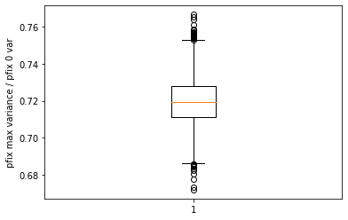

## Summary of experiment
- Detour graphs seem to have lower-than-expected probability of fixation with noise in fitness, we wanted to confirm if this is the case in graph of size 10 as well (previous experiments were done on graphs of size 100)
- Since the number of graphs of size 10 is limited, I hope to use those graphs to find out what might cause deviations from the geometric mean fitness principle

## Summary of results

### Average P-fix with max variance / P-fix with no variance is much higher for graphs of size 10
Recall that the calculated geometric mean for this set up, 
- wild type fitness 1
- s = 0.1
- mutant fitness from a binomial distribution of either 0.2 or 2
  
was about 0.632,
and that the experimental ratio between pfix_max / pfix_0 for graph of size 100 and beyond is about 0.615

Here in graphs of size 10, we observed a much higher ratio of pfix_max / pfix_0, suggesting that p-fix with variance is higher than expected in such small graphs, ie. high variability in fitness is less harmful. The reason for this is yet to be understood.

### Detour graphs still have a lower ratio of pfix_max / pfix_0

Legend:
- green: detour graphs, 
- orange: more dense graphs,
- blue: sparser graphs

### Geometric mean principle may not hold 

The ratio of pfix_max / pfix_0 in a wellmixed population in about 0.77.
The line y = 0.77x is plotted in the figure, and it seems like this is not the line that fits most points.
It could also be the case that those 2000 graphs are graphs that deviate from the line.

<!-- [Jekyll](http://jekyllrb.com) is a static site generator, an open-source tool for creating simple yet powerful websites of all shapes and sizes. From [the project's readme](https://github.com/mojombo/jekyll/blob/master/README.markdown):

  > Jekyll is a simple, blog aware, static site generator. It takes a template directory [...] and spits out a complete, static website suitable for serving with Apache or your favorite web server. This is also the engine behind GitHub Pages, which you can use to host your project’s page or blog right here from GitHub.

It's an immensely useful tool and one we encourage you to use here with Hyde.

Find out more by [visiting the project on GitHub](https://github.com/mojombo/jekyll). -->